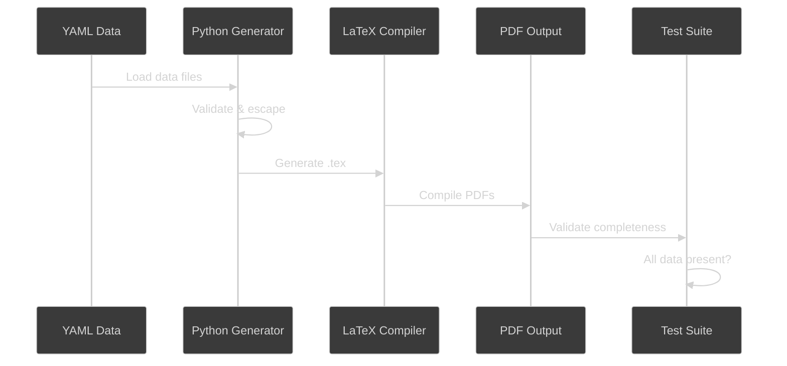

# CV Pipeline Template

> **Click "Use this template" to create your own CV pipeline!**

Automated CV generation pipeline that creates multiple psychologically-optimized CV variants from YAML data.

**🆕 Now with comprehensive guides to help you write better content, pass ATS screening, and land more interviews!**

## Video Tutorial

Watch the complete walkthrough of this CV pipeline template:

[](https://youtu.be/S2gpOr-mbf4)

**CV Pipeline as Code: LaTeX, YAML, and GitHub Actions** - Learn how to use this template to automate your CV generation workflow.

## Why This Approach?

**The AI Trap**: Most people use AI wrong for CVs

```mermaid
%%{init: {"theme": "dark", "themeVariables": {"darkMode": true, "background": "#2b2b2b", "mainBkg": "#3a3a3a", "secondBkg": "#4a4a4a"}}}%%
graph LR
    A[AI] -->|❌ Wrong| B[Complete CV]
    A -->|✓ Right| C[YAML Data]
    C --> D[Your Pipeline]
    D --> E[Professional CV]

    style B fill:#4a3a4a,stroke:#e599f7,stroke-width:2px
    style E fill:#3a4a3a,stroke:#94d82d,stroke-width:2px
```



**The Right Approach:**
- AI writes structured data (YAML facts)
- YOU control the pipeline and output
- Consistent quality across all variants
- Version controlled career narrative
- Update once → all CVs updated automatically

## Quick Start

### 1. Use This Template

Click the green "Use this template" button above to create your own repository.

### 2. Edit Your Data

Update the YAML files in `data/` with your information:

```bash
# Edit your personal info
vim data/personal.yaml

# Edit your work experience
vim data/experience.yaml

# Edit skills, education, certifications, strengths
vim data/skills.yaml data/education.yaml data/certifications.yaml data/strengths.yaml
```

### 3. Push to GitHub

```bash
git add .
git commit -m "Add my CV data"
git push
```

### 4. Get Your CVs

GitHub Actions will automatically:
- Generate 3 CV variants
- Run tests to verify all data is included
- Create a release with PDF downloads

Download from: `https://github.com/YOUR_USERNAME/YOUR_REPO/releases/latest`

## What You Get

### 📄 Multiple CV Formats

**Three psychologically-optimized PDF variants**:
- **Software Developer** - Creativity, problem-solving, technical expertise (Purple - innovation)
- **DevOps Engineer** - Collaboration, automation, developer enablement (Orange - energy & approachability)
- **Cloud Engineer** - Trust, scalability, expertise (Blue - professionalism)

**Plus ATS-friendly plain text versions** for online applications that get past Applicant Tracking Systems.

Each variant filters your experience based on tags and uses color psychology to create the right first impression.

### 📚 Comprehensive Content Guides

**Because formatting alone won't get you the job - great content will.**

This template now includes extensive guides to help you:

- **[Content Writing Guide](docs/CONTENT_GUIDE.md)** - Learn to write achievements that actually matter
  - The STAR method for impactful statements
  - How to quantify your impact (even without big numbers)
  - Common mistakes junior developers make
  - Before/after examples

- **[Achievement Examples](docs/ACHIEVEMENT_EXAMPLES.md)** - Real-world examples you can adapt
  - Examples for every experience level (junior, mid, student, bootcamp grad, career changer)
  - Organized by role (Software Dev, DevOps, Cloud Engineer)
  - 100+ concrete examples with metrics

- **[ATS Optimization Guide](docs/ATS_GUIDE.md)** - Get past the robots to reach humans
  - Understanding Applicant Tracking Systems
  - Do's and don'ts for ATS-friendly formatting
  - Keyword optimization strategies
  - Testing your CV for ATS compatibility

- **[Cover Letter Guide](docs/COVER_LETTER_GUIDE.md)** - Write compelling cover letters
  - The 4-paragraph structure that works
  - Examples by experience level
  - Customizable templates
  - Common mistakes to avoid

- **[Job Description Tailoring Guide](docs/TAILORING_GUIDE.md)** - Customize smartly for each role
  - The 80/20 approach (don't rewrite from scratch!)
  - Decoding what job descriptions really mean
  - Keyword extraction and optimization
  - Real examples of tailoring the same CV for different jobs

**Plus:** Cover letter template YAML structure to maintain consistency across applications.

## Data Structure

### personal.yaml
Basic contact information and taglines for each variant:

```yaml
first_name: "John"
last_name: "Doe"
email: "john.doe@example.com"
linkedin: "https://linkedin.com/in/johndoe"
github: "https://github.com/johndoe"
taglines:
  engineering-manager: "Engineering Manager"
  developer-advocate: "Developer Advocate"
  platform-engineer: "Senior Platform Engineer"
```

### experience.yaml
Work experience with tags for filtering:

```yaml
- title: "Senior Platform Engineer"
  company: "Tech Corp Inc"
  location: "Remote"
  start_date: "01/2022"
  end_date: "present"
  tags: ["technical", "platform", "leadership"]  # Used for filtering!
  achievements:
    - "Led development of microservices architecture"
    - "Improved deployment efficiency by 60%"
```

**Tag guide**:
- `development` - Appears in Software Developer CV
- `devops` - Appears in DevOps Engineer CV
- `cloud` - Appears in Cloud Engineer CV
- Mix tags to appear in multiple variants

### Other files
- `skills.yaml` - Programming languages, tools, cloud platforms
- `education.yaml` - Degrees and institutions
- `certifications.yaml` - Professional certifications with tags
- `strengths.yaml` - Key strengths with descriptions and tags

## Customization

### Add New Variants

1. Create template directory: `templates/new-variant/`
2. Add template file: `templates/new-variant/template.tex.j2`
3. Add tagline to `data/personal.yaml`
4. Tag relevant experience in `data/experience.yaml`
5. Update `Makefile` VARIANTS list
6. Update `.github/workflows/cv-build.yml` matrix

### Modify Colors/Design

Edit templates in `templates/*/template.tex.j2` - each uses AltaCV LaTeX class with customizable colors.

**Current color schemes** (based on color psychology research):
- **Software Developer**: Purple (#7C3AED) - Innovation, creativity, problem-solving
- **DevOps Engineer**: Orange (#FF6B35) - Energy, collaboration, developer enablement
- **Cloud Engineer**: Steel Blue (#4682B4) - Trust, reliability, professionalism

## Testing Locally

```bash
# Install dependencies
pip install PyYAML

# Build all CVs
make all

# Run tests
make test

# View PDFs
ls output/generated/*.pdf
```

### Generate ATS-Friendly Versions

For online job applications, generate plain text versions optimized for Applicant Tracking Systems:

```bash
# Generate all ATS versions
python3 scripts/generate_ats.py --variant software-developer --data-dir data/ --output output/ats/software-developer.txt
python3 scripts/generate_ats.py --variant devops-engineer --data-dir data/ --output output/ats/devops-engineer.txt
python3 scripts/generate_ats.py --variant cloud-engineer --data-dir data/ --output output/ats/cloud-engineer.txt

# View generated text files
ls output/ats/*.txt
```

**When to use each format:**
- **PDF versions**: Networking, direct emails, portfolios, after passing ATS
- **TXT versions**: Online application forms, company career portals

## Requirements

- Python 3.11+
- TeX Live (pdflatex)
- poppler-utils (pdftotext, pdfinfo)

## How It Works



**Key Steps:**
1. Load YAML data from `data/` directory
2. Python validates and escapes special characters
3. Direct Python string building generates LaTeX (no templates)
4. LaTeX compiler creates professional PDFs
5. Test suite verifies 100% data completeness
6. GitHub Actions automates entire workflow

## Troubleshooting

### PDFs not generating locally?

Check dependencies:
```bash
# Python packages
pip list | grep PyYAML

# LaTeX
pdflatex --version

# PDF utilities
pdftotext -v
```

### Tests failing?

Run verbose test output:
```bash
python scripts/test_data_completeness.py
```

Common issues:
- Missing data in YAML files
- Special characters in LaTeX (use `\&` for `&`, `\%` for `%`)
- Tags not matching template filters

### GitHub Actions failing?

Check:
1. YAML syntax is valid
2. No special characters breaking LaTeX compilation
3. All required files present in repository

## Color Psychology Research

The color schemes for each CV variant are based on research in color psychology and professional perception:

**Research Sources:**
- [Resume Color Psychology - Standout CV](https://standout-cv.com/usa/resume-advice/resume-color-psychology) - How colors influence hiring manager perception
- [Color Psychology in Resume Design](https://www.stopthebleedday.org/2024/02/14/color-psychology-in-resume-design-using-color-to-influence-perception/) - Color impact on first impressions
- [Colors on Your Resume - Resume Giants](https://www.resumegiants.com/blog/colors-on-resume/) - Professional color choices and their meanings

**Key Findings:**
- **Purple (#7C3AED)**: Associated with creativity, innovation, and problem-solving - ideal for Software Developers
- **Orange (#FF6B35)**: Conveys energy, warmth, and collaboration - perfect for DevOps Engineers focused on developer experience
- **Blue (#4682B4)**: Represents trust, reliability, and professionalism - suited for Cloud Engineers

## License

MIT - Use this template freely for your own CV!

## Getting Started With Content

**New to CV writing?** Start here:

1. **Read the [Content Writing Guide](docs/CONTENT_GUIDE.md)** - Learn the fundamentals
2. **Browse [Achievement Examples](docs/ACHIEVEMENT_EXAMPLES.md)** - Find inspiration for your level
3. **Review the [ATS Guide](docs/ATS_GUIDE.md)** - Understand how to get past automated screening
4. **Practice tailoring** with the [Tailoring Guide](docs/TAILORING_GUIDE.md)

**Writing cover letters?**
- Check out the [Cover Letter Guide](docs/COVER_LETTER_GUIDE.md)
- Use `data/cover-letter-template.yaml` as a starting structure

## FAQ

**Q: What makes this different from other CV templates?**
A: This isn't just a template - it's a complete system with comprehensive guides on writing compelling content, passing ATS screening, and tailoring applications. The template handles formatting; the guides help you stand out.

**Q: I'm worried about having the same CV as others. How do I differentiate myself?**
A: **Your unique content differentiates you, not the template.** This is why we've added extensive content guides - to help you write achievements that are specific to your experience and impactful. Two people using this template will have completely different CVs because they have different experiences, achievements, and ways of telling their story.

**Q: Should I use the PDF or ATS text version?**
A: Use **PDF** for: networking, direct emails, LinkedIn, portfolios, in-person meetings. Use **TXT** for: online application portals, company career pages, anywhere that asks you to upload or paste your CV.

**Q: Can I add more CV variants?**
A: Yes! Create a new template directory, add Jinja2 template, and update the Makefile.

**Q: Do I need to configure secrets or tokens?**
A: No! The template works out-of-the-box with no configuration needed.

**Q: Can I customize the LaTeX templates?**
A: Absolutely! Edit the `.tex.j2` files in `templates/*/` directories.

**Q: How do I change which experience appears in each variant?**
A: Use the `tags` field in `experience.yaml`. Each template filters based on specific tags.

**Q: Can I use this for commercial purposes?**
A: Yes! This template is MIT licensed - use it however you'd like.

**Q: I'm a bootcamp grad / career changer / student. Will this work for me?**
A: Absolutely! Check out the [Achievement Examples](docs/ACHIEVEMENT_EXAMPLES.md) which has sections specifically for bootcamp grads, career changers, students, and interns with relevant examples you can adapt.
